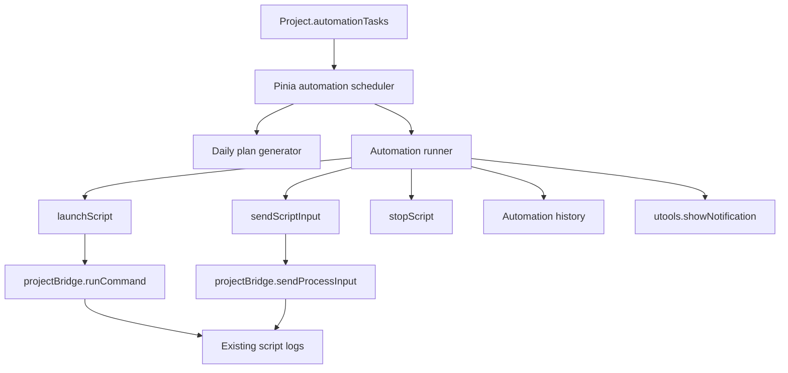

# 自动任务功能技术设计

## Architecture

自动任务作为项目配置的一部分保存到 `Project`，由前端 Pinia store 负责调度、执行状态、历史记录和 UI 跳转。命令执行继续复用现有 `launchScript`、`stopScript`、`sendScriptInput` 和 preload 里的 `runCommand` / `sendProcessInput`，避免出现第二套脚本执行路径。

## Data Model

Add typed models in `src/types.ts`:

- `ProjectAutomationTask`: id, name, enabled, scriptIds, schedule, notifyEnabled, maxScriptRuntimeMinutes, inputConfigs, exitConfigs, dailyPlans, history, createdAt, updatedAt.
- `ProjectAutomationSchedule`: discriminated union for `fixed` and `random`.
- Fixed schedule: startTime, dailyCount, intervalMinutes.
- Random schedule: windowStart, windowEnd, dailyCount, minIntervalMinutes, maxIntervalMinutes.
- `ProjectAutomationInputStep`: mode `delay` or `output-match`, value, delayMs, matchText, timeoutMs.
- `ProjectAutomationScriptInputConfig`: scriptId, steps.
- `ProjectAutomationExitConfig`: scriptId, enabled, matchText.
- `ProjectAutomationDailyPlan`: date, entries with plannedAt, status, runId.
- `ProjectAutomationHistoryEntry`: run id, task id/name, project id/name, plannedAt, startedAt, endedAt, status, per-script result, reason.

Existing project loading should normalize missing `automationTasks` to `[]`. Persisted project output should include normalized automation task data and cap history at 20 entries.

## Scheduling

The scheduler runs only while the uTools plugin is active. On project load and task changes, it computes today's plan for enabled tasks:

- Fixed schedule generates `dailyCount` timestamps from `startTime` using `intervalMinutes`.
- Random schedule generates `dailyCount` timestamps inside the configured window and validates min/max interval constraints.
- Plans are generated once per day per task and stored so the user can inspect today's fixed random times.
- Missed entries from plugin inactivity are marked missed; they are not backfilled.
- If constraints cannot produce a valid plan, the form blocks save before persistence.

The scheduler should use one in-memory timer for the nearest pending entry, then recompute after each trigger or state change. It should avoid long-lived per-entry timers where possible.

## Execution Semantics

Automation execution is grouped by project:

- Different projects may run automation concurrently.
- A project can have only one active automation run at a time.
- If a plan fires while that project already has an active automation run, the plan entry is skipped and history records the reason.
- Scripts inside one task run serially in configured order.
- Any script failure stops remaining scripts for the same task.
- If a selected script is missing, empty, unavailable, already running, or stopping, the run records a skip/failure reason according to the existing script state.
- Each script has max runtime, default 30 minutes. On timeout, stop the script, record failure, and stop remaining scripts.

The runner should subscribe to existing bridge events through store state rather than introducing a new process channel. It needs a local run context keyed by projectId/scriptId/pid to know which automation run is waiting for output, exit, timeout, or input completion.

## Automated Input And Keyword Exit

Input is configured per script, not per task. Two step modes are supported:

- Delay mode sends the configured text after a delay from script start or from the previous input step.
- Output match mode waits until stdout/stderr contains configured text, then sends input. Each match step has its own timeout; timeout fails the script and stops later scripts.

All input text is stored and shown in plain text. Sent input remains visible in existing terminal logs and automation history.

After all input steps for a script complete, an optional keyword exit watcher can wait for configured output text and then stop the script. Keyword exit does not have its own timeout; the script max runtime is the fallback.

## UI

Add a project-level `AutomationTab.vue` under `src/components/project/` and wire it into `ProjectDetails.vue`:

- Task list with enabled state, schedule type, next run, today's plan, recent result, notification state.
- Create/edit modal or inline editor for task name, scripts, schedule, intervals, max runtime, notification, input steps, keyword exit.
- History section showing the most recent 20 task history entries.

Add a dashboard-level automation overview entry from `Dashboard.vue`:

- Top toolbar button opens a lightweight cross-project overview.
- Overview shows task count, enabled/running/failed/missed summaries, next upcoming tasks, and recent results.
- Clicking an item selects the project and opens its Automation tab.

## Notifications

Use `window.utools?.showNotification?.(message)` for system-level notifications when enabled per task. Notification failure or API absence must not affect execution; history is still written. Notify on completed, failed, skipped, and missed outcomes.

## Compatibility And Validation

Storage compatibility must be preserved:

- Old projects without automation fields load with empty automation task lists.
- Import/export includes automation tasks and histories after normalization.
- `scripts/validate-project-storage-compat.mjs` should cover missing automation fields and persistence with automation fields.

Validation commands expected for implementation:

- `npm run type-check`
- `npm run validate:project-storage`
- Add focused helper tests if scheduling logic is extracted into a pure utility.

## Trade-Offs

- Keeping scheduling in the active plugin matches the MVP boundary and avoids OS-level scheduler complexity.
- Persisting daily random plans makes behavior inspectable but means today's random times do not reshuffle continuously.
- Plain-text input storage follows the product decision but should be visible in UI copy so users avoid storing high-risk secrets.
