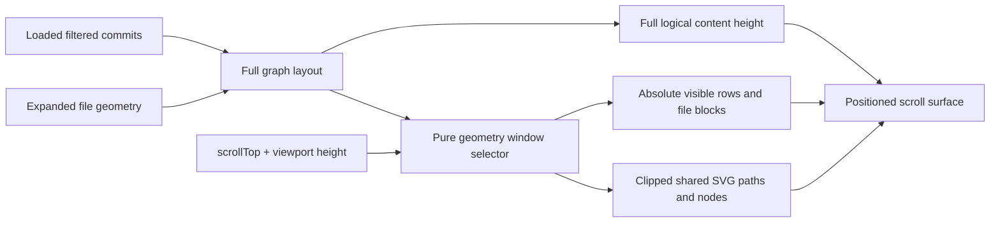

# Git Commit History Virtualization Design

## Decision

Keep the complete `layoutGitCommitGraph(...)` result for all loaded filtered commits. Virtualize its presentation rather than its topology: render a finite row window and a finite shared-SVG geometry window above one full-height positioned surface.

The rejected alternative is row-only virtualization with a full shared SVG. It reduces row DOM but leaves path/node growth unbounded. The other rejected alternative is index-only SVG filtering; it drops a preceding row's segment when that segment enters an expanded block or the viewport at a window edge.

## Data Flow



## Layout And Window Contract

`gitCommitGraph.ts` remains the owner of graph topology and geometry. Extend each layout row with explicit logical top and block height while preserving current `y`, lanes, segment data, width, and total height. This makes the row location an explicit contract instead of requiring the component to reverse-engineer it from `y`.

Add a pure graph-window selector in the same library. Its input is the full layout plus a pixel viewport and finite pixel overscan. Its output contains:

- the contiguous visible row range;
- rows whose fixed commit row or expanded block intersects the overscanned range;
- nodes whose center is inside the SVG range;
- segments whose inclusive vertical bounding range intersects the SVG range.

Rows are ordered by increasing logical top, so the selector should use a binary search for the first candidate and scan only the finite window. It may inspect one preceding row before filtering segment geometry. This covers the one-pixel inter-row gap and a segment that starts outside the visible row window but ends at the next row's top.

The selection rule is geometric, not graph-topological:

```text
segment is rendered when
max(segment.from.y, segment.to.y) >= svgWindowTop
and
min(segment.from.y, segment.to.y) <= svgWindowBottom
```

The layout remains complete; paths outside the window are simply omitted from DOM. A rendered boundary path retains its original global coordinates and is clipped by the SVG viewport.

## Vue Rendering Shape

The history scroll container keeps a single logical surface with `height: graphContentHeight`. Each rendered commit row and its optional expanded block becomes absolutely positioned from the full layout's global top. No hidden offscreen rows are retained.

The SVG becomes a finite absolute layer with:

- `top` set to the overscanned SVG window top;
- CSS height set to the SVG window height;
- a `viewBox` whose y-origin is that same global top;
- original global path/node coordinates;
- normal SVG clipping at its physical bounds.

This preserves lane continuity without inventing edge stubs or changing the path builder. A DOM-bound requirement applies to both row and SVG primitives.

## Viewport State And Lifecycle

`GitCommitHistory.vue` owns a local viewport state `{ top, height }`. A scroll handler coalesces reads of `scrollTop` and `clientHeight` into one animation-frame update. A `ResizeObserver` on the scroll root updates the viewport on panel resize. Both are component-local and cleaned up on unmount; no Pinia or persisted preference is introduced.

On graph scroll:

- synchronize the viewport window;
- close the active tooltip before its row can unmount;
- preserve current context-menu behavior, which already closes on scroll;
- do not create new tooltip detail loads.

When a context-menu owner is outside the next row window, close the menu. Focus restoration must require `opener.isConnected` to avoid focusing a removed row.

## Variable Heights And Scroll Anchoring

Before an operation that changes expanded-file geometry, capture the first visible logical row as `{ hash, offset }`, where `offset = scrollTop - row.top`. After Vue applies the changed layout, find that row by hash and restore `scrollTop = row.top + offset`, clamped to the new surface. Use this around:

- opening/closing an expanded commit;
- the asynchronous loading/error completion for expanded commit files;
- directory expansion/collapse;
- list/tree display mode changes;
- repository/context cleanup when a valid anchor remains meaningful.

Page append changes only the tail, so it preserves `scrollTop` naturally; no anchor correction is performed for ordinary pagination.

## Existing State Contracts

- Selected hashes remain parent-owned props. A row uses the existing hash-based selected check when it mounts.
- Expanded file and collapsed-directory state remain keyed by commit hash. A row rehydrates naturally when it re-enters the window.
- The existing observer sentinel remains after the full-height graph surface and retains its current root and pagination guard.
- Tooltip state remains one visible reactive object plus the existing bounded session cache. Window changes never add a per-hash reactive details record.
- Existing `v-memo` remains useful for the finite mounted row set but is not presented as virtualization itself.

## Structured Ref Correction

The current graph-color lookup is keyed by bare ref name, allowing a tag named `main` to inherit the local `main` graph color. Correct it narrowly by passing graph-color data keyed by structured ref identity (`kind:name`), and matching the component's current/upstream/base graph references by the same structured identity. This keeps the visual design intact and prevents color inference from display text.

## Compatibility And Rollback

No persistence, bridge contract, migration, or Git command changes are required. The pure layout/window helper is independently testable. If a visual regression appears, the rendering change can be reverted while retaining the previously correct full layout and no data needs recovery.
