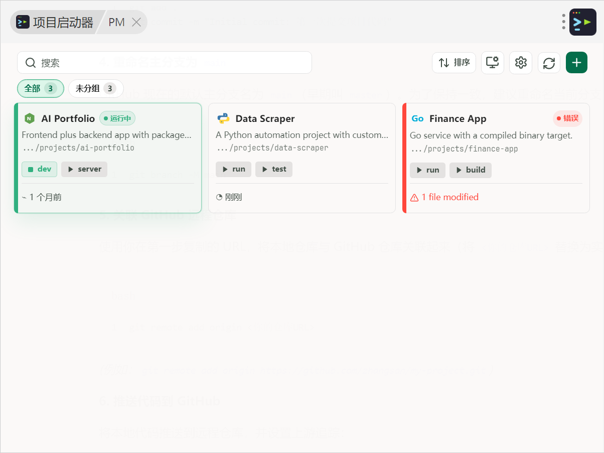
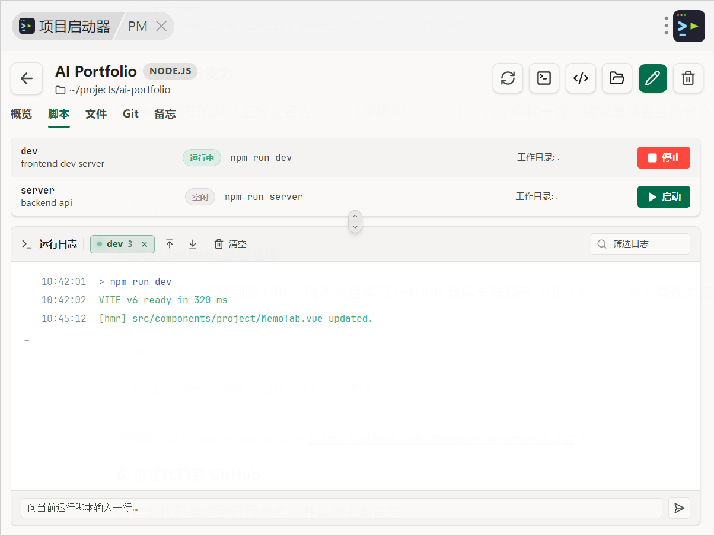
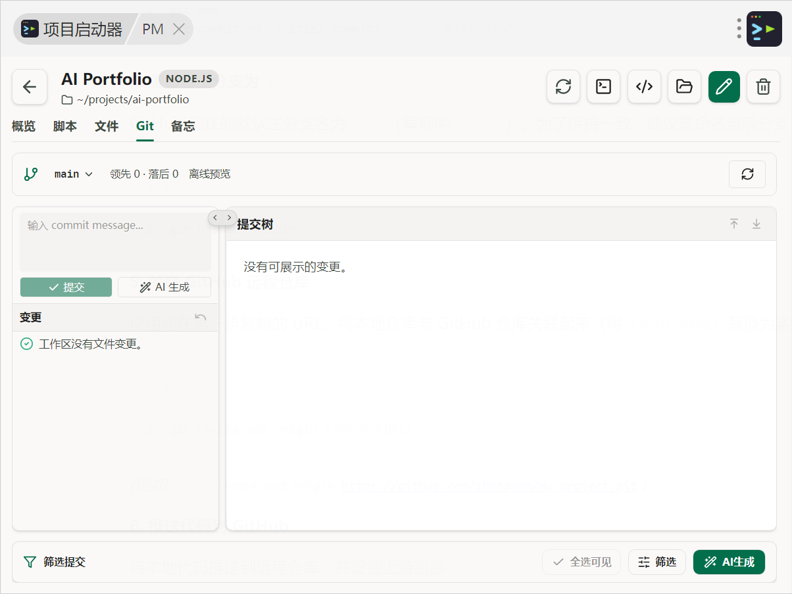

# uTools Project Launch

一个给开发者用的项目快捷启动与管理工具。把常用项目、启动脚本、运行日志、Git 状态、文件预览、备忘待办和本机开发环境检测收进同一个轻量插件里，适合管理前端、后端、脚本工具、桌面程序或任何需要频繁启动的本地工程。

<!-- 在这里插入项目总览截图，例如 docs/screenshots/dashboard.png -->

## 为什么做它

本地开发项目一多，常见动作会变得很分散：找目录、开终端、跑脚本、看日志、查 Git 改动、记启动说明、检查 Node/Python/Go/Git 是否可用。uTools Project Launch 把这些高频动作集中到 uTools 里，用一个入口完成项目定位、启动、观察和轻量维护。

## 主要功能

- **项目启动台**：添加本地项目，记录名称、路径、类型、图标、分组、说明、默认分支、环境变量和启动脚本。
- **脚本运行与日志**：为每个项目配置多个命令，支持启动、停止、状态展示、日志筛选、自动滚动和向运行中的脚本发送输入。
- **文件浏览与轻量编辑**：内置文件树、文本预览、代码高亮、Markdown 渲染、图片识别、查找替换和可编辑文本保存。
- **Git 工作区面板**：查看分支、ahead/behind、变更文件、diff、提交历史和提交详情，并支持常用暂存、撤销、提交、切换分支等本地操作。
- **AI 辅助分析**：可对 Git 变更或提交范围生成总结、分析、评估，也可根据 diff 生成 commit message；支持 uTools 内置模型、OpenAI 兼容接口和 Anthropic 兼容接口。
- **备忘与待办**：每个项目维护独立 Markdown 备忘和待办清单，用来记录启动方式、排障经验、发布事项或团队约定。
- **开发环境检测**：检测 Node.js、npm、pnpm、Yarn、Python、pip、Go、Git、Docker 的可用性、版本和路径。
- **偏好与迁移**：支持中英文界面、浅色/深色/跟随系统主题、默认终端/编辑器配置，以及项目配置导入导出。

## 界面预览







## 技术栈

- Vue 3 + TypeScript
- Vite 6
- Pinia
- Tailwind CSS 4
- lucide-vue-next
- markdown-it + highlight.js
- uTools preload + Node.js 本地能力

## 快速开始

```bash
npm install
npm run dev
```

开发服务默认运行在：

```text
http://localhost:3421
```

## 构建

```bash
npm run lint
npm run build
```

构建产物输出到 `dist/`。uTools 加载插件时请选择构建后的 `dist/plugin.json`，不要直接选择项目根目录。

构建后的关键文件通常包括：

```text
dist/
├── index.html
├── plugin.json
├── preload.js
├── logo.png
├── logo.svg
└── assets/
```

## 在 uTools 中加载

1. 执行 `npm run build`。
2. 打开 uTools 开发者工具。
3. 选择工程配置文件 `dist/plugin.json`。
4. 在 uTools 中通过 `PM`、`project manager` 或项目名称关键字打开插件。

## 常用脚本

| 命令                               | 说明                                |
| ---------------------------------- | ----------------------------------- |
| `npm run dev`                      | 启动 Vite 开发服务，默认端口 `3421` |
| `npm run build`                    | 构建 uTools 插件产物                |
| `npm run preview`                  | 本地预览构建结果                    |
| `npm run lint`                     | 执行 TypeScript 类型检查            |
| `npm run type-check`               | 同 `lint`，执行 TypeScript 类型检查 |
| `npm run clean`                    | 删除 `dist/` 构建目录               |
| `npm run validate:ai-reasoning`    | 校验 AI reasoning 解析兼容性        |
| `npm run validate:project-storage` | 校验项目存储兼容性                  |

## 项目结构

```text
src/
├── App.vue                  # 应用入口与 uTools 生命周期处理
├── components/
│   ├── dashboard/            # 项目总览与项目卡片
│   ├── environment/          # 开发环境检测
│   ├── layout/               # 设置页
│   ├── project/              # 项目详情、脚本、文件、Git、备忘
│   └── terminal/             # 运行日志终端
├── lib/                      # i18n、Markdown、桥接与工具函数
├── store/                    # Pinia 状态与业务动作
└── types.ts                  # 共享类型定义

public/
├── plugin.json               # uTools 插件配置
├── preload.js                # uTools preload，本地文件/进程/Git 能力
├── logo.png
└── logo.svg
```

## 数据与权限说明

- 项目配置、偏好设置、AI 配置、备忘和待办主要保存在本地 uTools / 浏览器存储中。
- `preload.js` 会使用 Node.js 能力访问本地项目目录、启动/停止命令、读取文件、执行 Git 命令和检测开发工具版本。
- Git 写操作仅围绕本地工作区展开，例如暂存、撤销、提交、切换分支或检出提交；使用前建议确认当前工作区状态。
- AI 分析会把选定的 Git 信息或 diff 发送给你配置的模型提供方；涉及私有项目时请先确认模型与接口策略。

## 适合谁

- 同时维护多个本地项目的开发者。
- 需要频繁切换项目、启动服务和查看日志的人。
- 想把 Git 观察、备忘、待办和环境检查放进一个轻量桌面入口的人。
- 使用 uTools 作为日常启动器，并希望把开发工作流也收进 uTools 的人。
