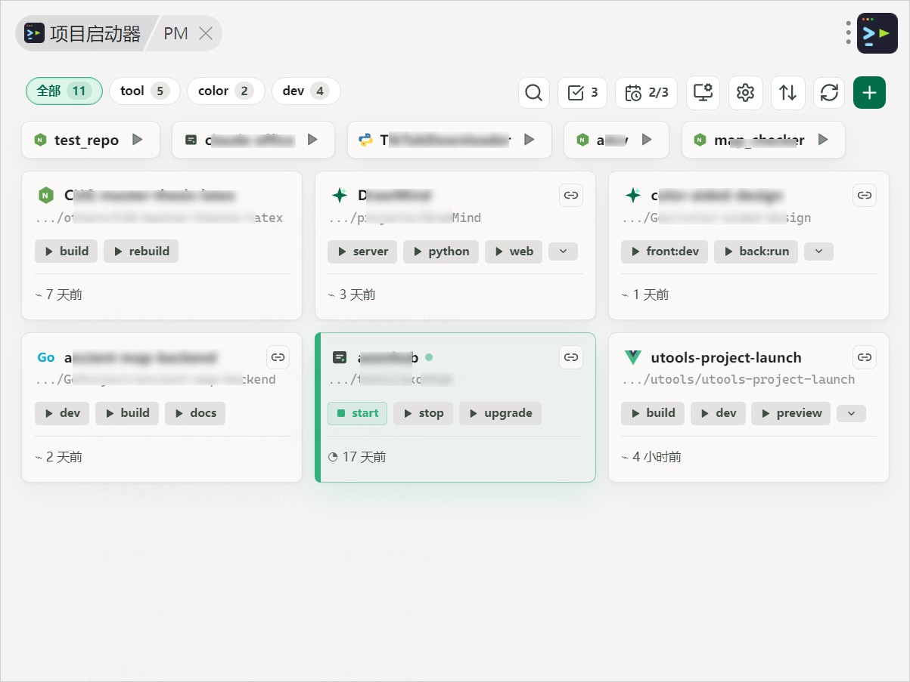
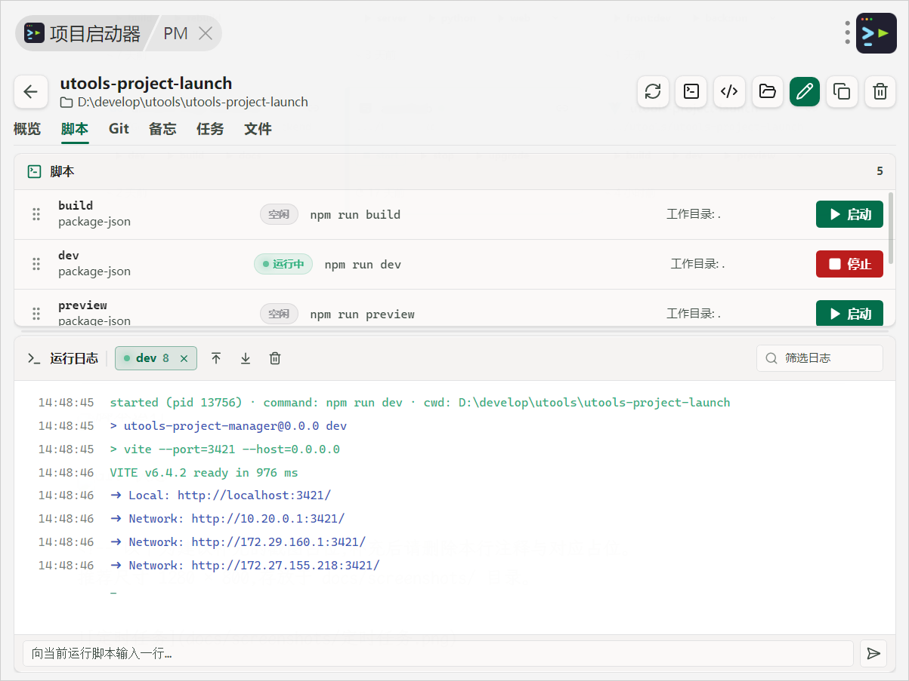
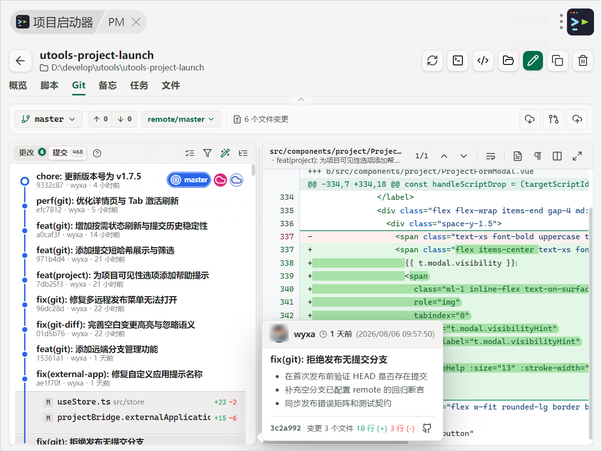
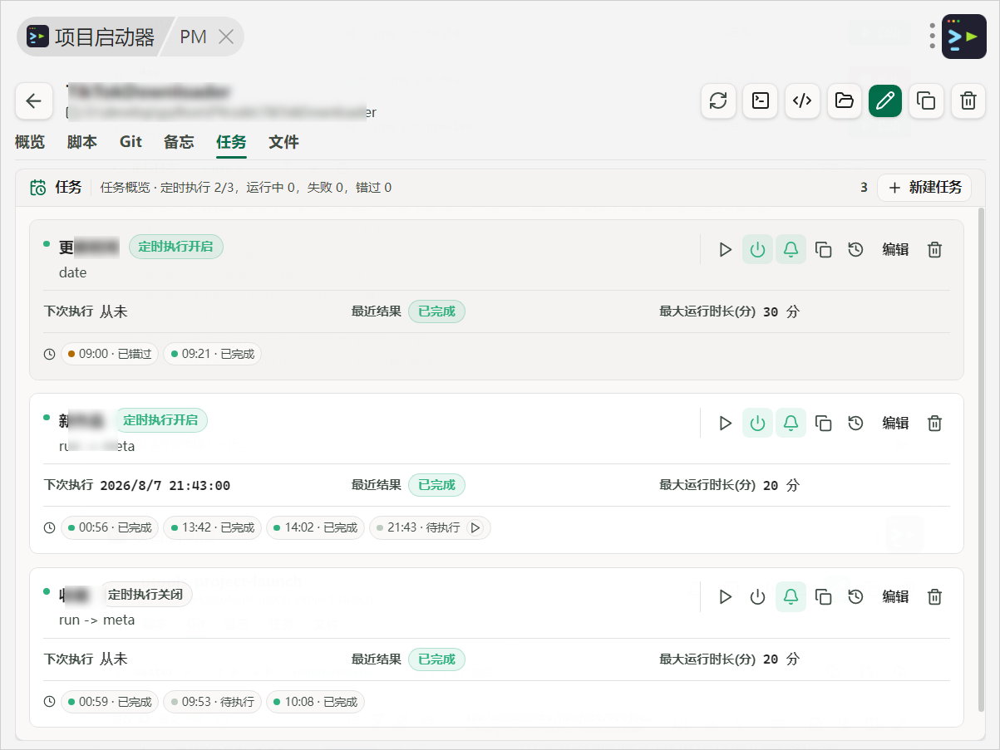
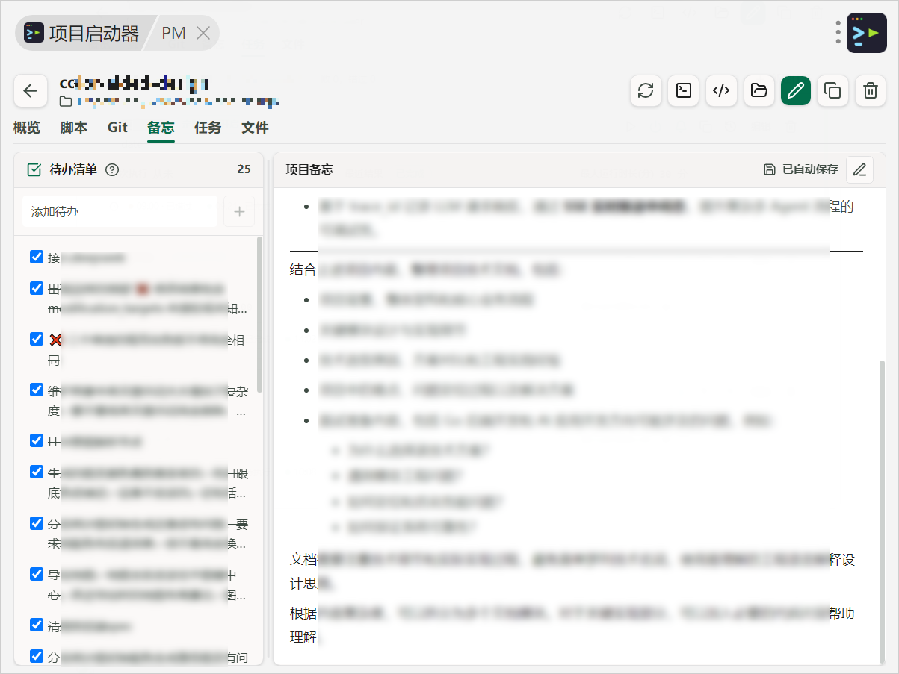
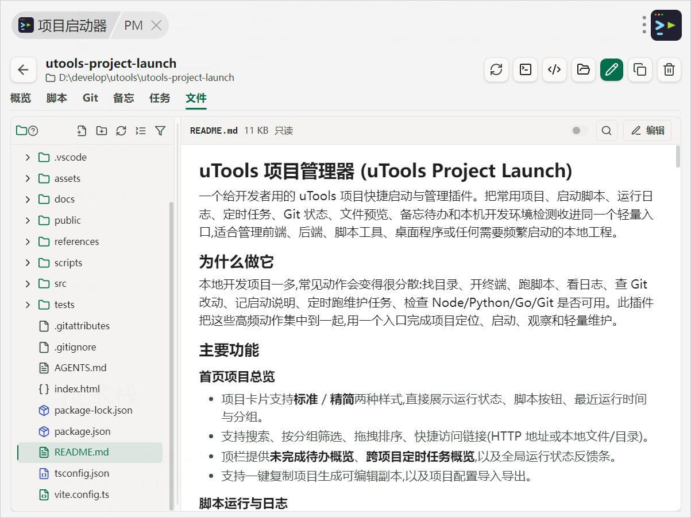
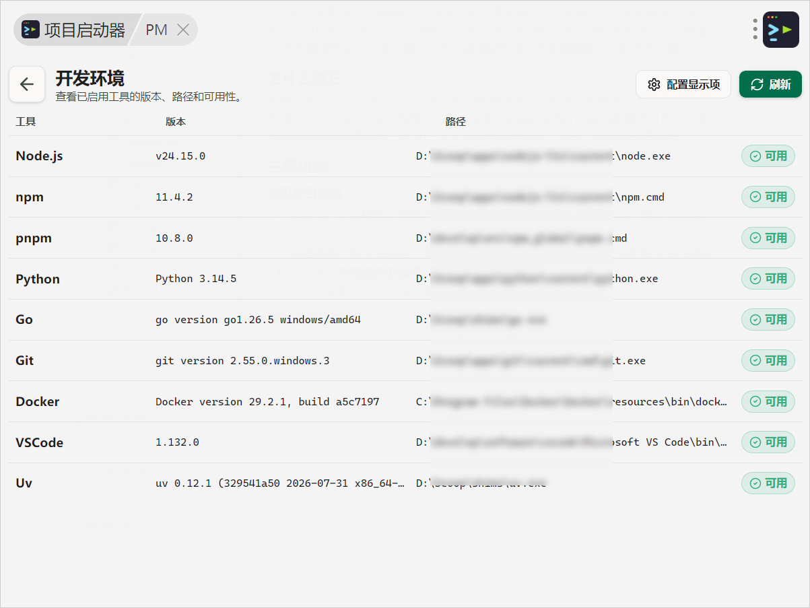

# uTools 项目管理器插件 (uTools Project Launch)

一个给开发者用的 uTools 项目快捷启动与管理插件。把常用项目、启动脚本、运行日志、定时任务、Git 状态、文件预览、备忘待办和本机开发环境检测收进同一个轻量入口，适合管理前端、后端、脚本工具、桌面程序或任何需要频繁启动的本地工程。

## 为什么做它

本地开发项目一多，常见动作会变得很分散：找目录、开终端、跑脚本、看日志、查 Git 改动、记启动说明、定时跑维护任务、检查 Node/Python/Go/Git 是否可用。此插件把这些高频动作集中到一起，用一个入口完成项目定位、启动、观察和轻量维护。

## 主要功能

### 首页项目总览

- 项目卡片支持**标准** / **精简**两种样式，直接展示运行状态、脚本按钮、最近运行时间与分组。
- 支持搜索、按分组筛选、拖拽排序、快捷访问链接(HTTP 地址或本地文件/目录)。
- 顶栏提供**未完成待办概览**、**跨项目定时任务概览**，以及全局运行状态反馈条。
- 支持一键复制项目生成可编辑副本，以及项目配置导入导出。

### 脚本运行与日志

- 每个项目可配置多个启动命令，支持启动、停止、状态展示与拖拽排序，可为每个命令单独设置工作目录。
- 内置**运行日志终端**：实时输出、日志筛选、自动滚动、一键复制，并可向运行中的脚本发送输入。
- **脚本自动发现**：从 `package.json` scripts 或 `Makefile` 目标一键导入为启动命令(危险目标需显式确认)。

### 定时任务

- 为项目创建定时任务，串行执行一个或多个脚本，同一项目内互不并发。
- **固定时间**或**随机时间窗口**两种计划，支持错过策略(宽限内立即执行 / 过期后立即执行 / 标记错过)。
- **自动输入序列**：按固定延迟发送，或匹配到脚本输出后发送；支持匹配关键词后自动停止脚本。
- 单脚本最大运行时长兜底、失败即停；支持系统通知开关与最近 20 条执行历史。

### 文件浏览与轻量编辑

- 内置文件树：展开/折叠、按名称过滤、新建/重命名/删除文件与目录、复制相对/绝对路径。
- 文本预览：代码高亮、Markdown 渲染(含本地图片)、图片查看。
- 轻量编辑：行号开关、查找/替换、未保存内容保护。

### Git 工作区

- 仓库列表统一展示**主仓库**、**linked worktree** 与已检出 **submodule**，支持 Git 环境继承(Git 钩子可正常执行)。
- 工作区变更：暂存 / 取消暂存 / 丢弃、stash、提交(含 amend、AI 生成提交信息、撤销上次提交)。
- **Diff 查看**：统一 / 分屏两种模式、字符级差异高亮、忽略空白切换、hunk 导航与全文展开。
- **提交历史**：提交图渲染与虚拟化滚动、关键词 / 作者 / 日期筛选、提交右键菜单、提交 tooltip 与 GitHub 一键跳转。
- 常用仓库操作：分支与标签管理、远端与远端分支管理、fetch / pull / push、**发布当前分支**、**初始化仓库**、单提交 cherry-pick / revert(冲突自动中止并恢复)。

### AI 辅助分析

- 对 Git 变更或提交范围生成**总结**、**分析**、**评估**(内置模式，支持自定义提示词)。
- 根据 diff 一键生成 **commit message**。
- **多轮修订**：可在已有分析结果上继续追问，线性版本回溯，不丢失历史版本。
- 支持 uTools 内置模型、OpenAI 兼容接口、Anthropic 兼容接口。

### 备忘与待办

- 每个项目独立的 Markdown 备忘，支持渲染 / 编辑切换与自动保存。
- 待办清单：勾选完成、双击编辑、拖拽排序，首页展示未完成概览。

### 开发环境检测

- 内置检测 Node.js、npm、pnpm、Yarn、Python、pip、Go、Git、Docker 的可用性、版本与路径。
- 支持自定义检测项，以及覆盖内置项的检测命令与版本参数。

### 外部应用与终端

- 预置 VS Code、Cursor，可新增自定义应用(命令模板支持 `{path}` / `{projectPath}` 占位符)。
- 左键使用默认应用打开项目，右键临时选择其他已启用应用；Git 仓库菜单中也可直接选择。
- 默认终端偏好：Windows Terminal / PowerShell / CMD / Terminal / iTerm2 / Warp / Linux Terminal，或自定义命令。

### 偏好与迁移

- 中英文界面、浅色 / 深色 / 跟随系统主题。
- 项目可见性(公共 / 本机，本机项目通过设备 ID 隔离)、详情页标签拖拽排序。
- 项目配置导入导出，旧版本偏好自动迁移。

## 界面预览















## 技术栈

- Vue 3 + TypeScript
- Vite 6 + Vitest
- Pinia
- Tailwind CSS 4
- lucide-vue-next
- markdown-it + highlight.js
- overlayscrollbars
- uTools preload + Node.js 本地能力

## 快速开始

```bash
npm install
npm run dev
```

开发服务默认运行在：

```text
http://localhost:3421
```

## 构建

```bash
npm run lint
npm run build
```

构建产物输出到 `dist/`。uTools 加载插件时请选择构建后的 `dist/plugin.json`，不要直接选择项目根目录。

构建后的关键文件通常包括：

```text
dist/
├── index.html
├── plugin.json
├── preload.js
├── logo.png
├── logo.svg
└── assets/
```

## 在 uTools 中加载

1. 执行 `npm run build`。
2. 打开 uTools 开发者工具。
3. 选择工程配置文件 `dist/plugin.json`。
4. 通过 `PM`、`project manager` 打开项目管理器；直接输入项目名称关键字可一步进入对应项目的启动区。

## 常用命令

| 命令                                  | 说明                                 |
| ------------------------------------- | ------------------------------------ |
| `npm run dev`                         | 启动 Vite 开发服务，默认端口 `3421`  |
| `npm run build`                       | 构建 uTools 插件产物到 `dist/`       |
| `npm run preview`                     | 本地预览构建结果                     |
| `npm run lint` / `npm run type-check` | TypeScript 类型检查 (`tsc --noEmit`) |
| `npm run clean`                       | 删除 `dist/` 构建目录                |
| `npm run test:git-diff`               | 运行 Git diff 相关单元测试           |
| `npm run validate:ai-reasoning`       | 校验 AI reasoning 解析兼容性         |
| `npm run validate:git-commits`        | 校验 Git 提交记录解析                |
| `npm run validate:git-diff`           | 校验 Git diff 解析                   |
| `npm run validate:git-workspace`      | 校验 Git 工作区桥接(含单元测试)      |
| `npm run validate:markdown-images`    | 校验 Markdown 图片安全与渲染         |
| `npm run validate:project-files`      | 校验项目文件桥接                     |
| `npm run validate:project-storage`    | 校验项目存储兼容性                   |
| `npm run validate:process-results`    | 校验进程结果批次处理                 |
| `npm run benchmark:git-interactions`  | Git 交互性能基准测试                 |

## 项目结构

```text
src/
├── App.vue                  # 应用入口与 uTools 生命周期处理
├── components/
│   ├── dashboard/            # 项目总览与项目卡片
│   ├── environment/          # 开发环境检测
│   ├── layout/               # 设置页
│   ├── project/              # 项目详情：脚本、定时任务、文件、Git、备忘
│   └── terminal/             # 运行日志终端
├── composables/              # 可复用组合式函数(如可拖拽分栏)
├── lib/                      # i18n、Markdown、Git diff/提交图、桥接与工具函数
├── store/                    # Pinia 状态与业务动作
└── types.ts                  # 共享类型定义

public/
├── plugin.json               # uTools 插件配置
├── preload.js                # uTools CommonJS preload：本地文件/进程/Git 能力
├── logo.png
└── logo.svg

tests/                        # Vitest 单元测试
scripts/                      # 校验与基准脚本
```

## 数据与权限说明

- 项目配置、偏好设置、AI 配置、备忘、待办和定时任务主要保存在本地 uTools / 浏览器存储中；定时任务依赖插件运行期间的前台调度，错过计划不会自动补跑。
- `preload.js` 会使用 Node.js 能力访问本地项目目录、启动 / 停止命令、读取文件、执行 Git 命令和检测开发工具版本。
- Git 写操作仅围绕本地工作区展开，例如暂存、撤销、提交、切换分支、cherry-pick / revert；使用前建议确认当前工作区状态。
- AI 分析会把选定的 Git 信息或 diff 发送给你配置的模型提供方；涉及私有项目时请先确认模型与接口策略。

## 版本历程

- **v1.7.5**：Git 按需状态刷新、提交短哈希与筛选、远端分支管理、多远程发布修复、提交 tooltip GitHub 跳转。
- **v1.7.3**：自动识别系统终端和编辑器并提供回退启动、跨平台启动与偏好迁移。
- **v1.7.0**：统一项目卡片状态展示。
- **v1.6.x**：定时任务、外部应用打开器、Git AI 多轮修订、uTools 深色主题联动、环境检测增强等。
- **v1.5.x**：项目启动台、脚本与日志、Git 工作区、备忘待办等基础能力逐步成型。

## 贡献

欢迎提交 Issue 和 Pull Request。提交 PR 时请遵循以下基本要求：

- **分支**：可以从最新的 `master` 切出特性分支。
- **提交信息**：使用 Conventional Commits 风格，例如 `feat:`， `fix:`， `refactor:`， `docs:`， `chore:`。
- **范围**：改动尽量小而聚焦，一个 PR 只解决一个问题；大改动请先开 Issue 讨论。
- **验证**：提交前确保以下检查通过：
  ```bash
  npm run lint
  npm run build
  ```
- **测试**：新增或修改逻辑时尽量补充对应单元测试(位于 `tests/`)。目前项目没有统一的 `npm test` 全量命令，相关测试分散在 `test:git-diff`、`validate:git-workspace` 等脚本中；涉及对应模块的改动请运行相关测试，至少确保没有破坏现有测试。
- **描述**：PR 描述中说明改动目的、影响范围，如有截图或复现步骤更佳。

## 适合谁

- 同时维护多个本地项目的开发者。
- 需要频繁切换项目、启动服务和查看日志的人。
- 想把 Git 观察、备忘、待办和环境检查放进一个轻量桌面入口的人。
- 使用 uTools 作为日常启动器，并希望把开发工作流也收进 uTools 的人。
