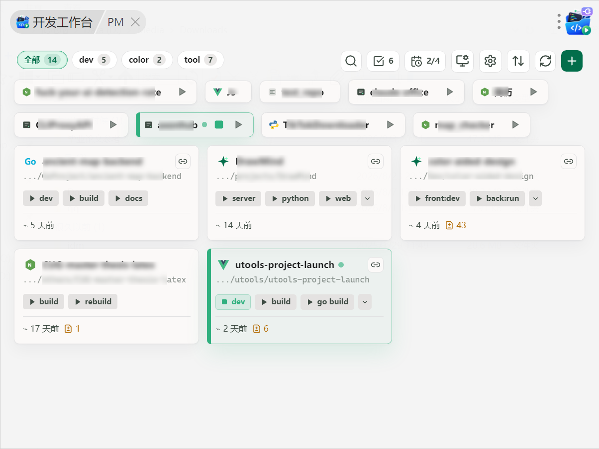
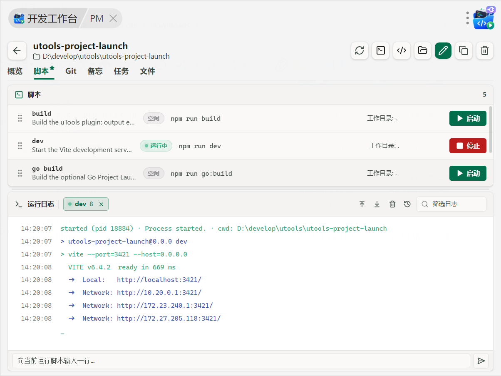
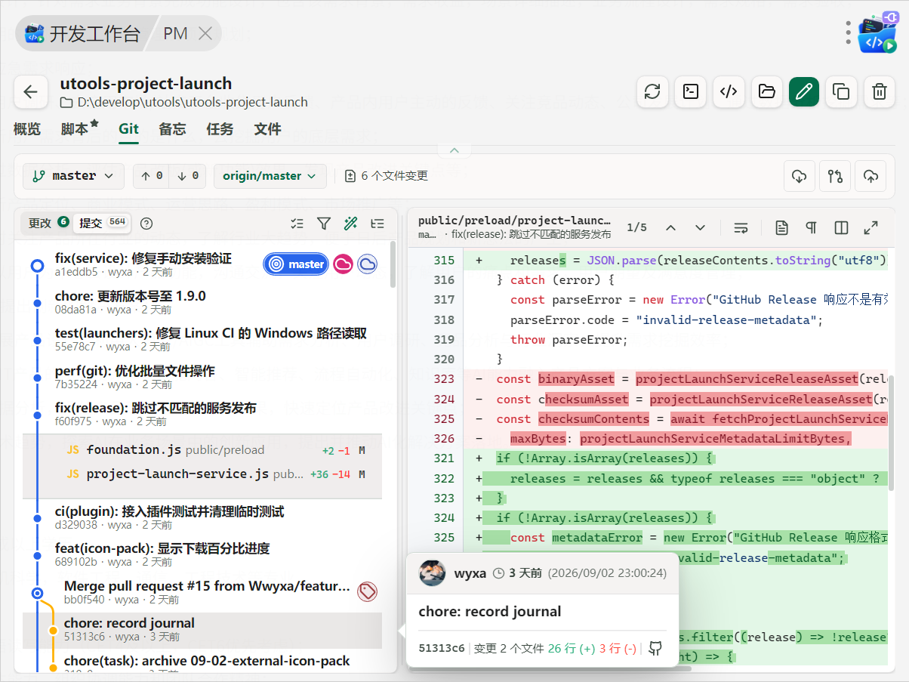
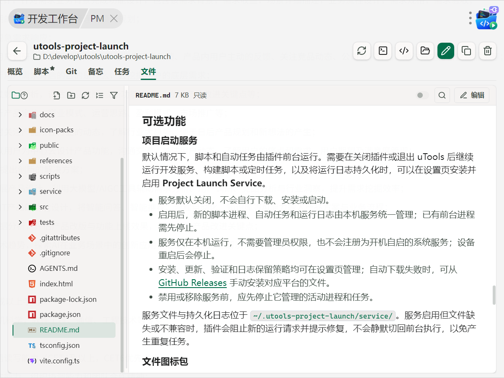
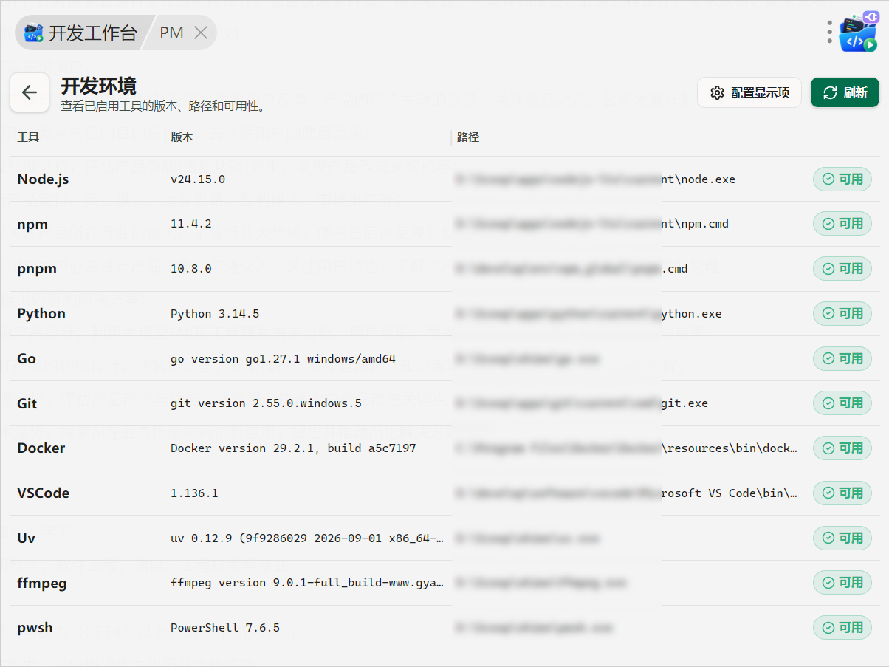
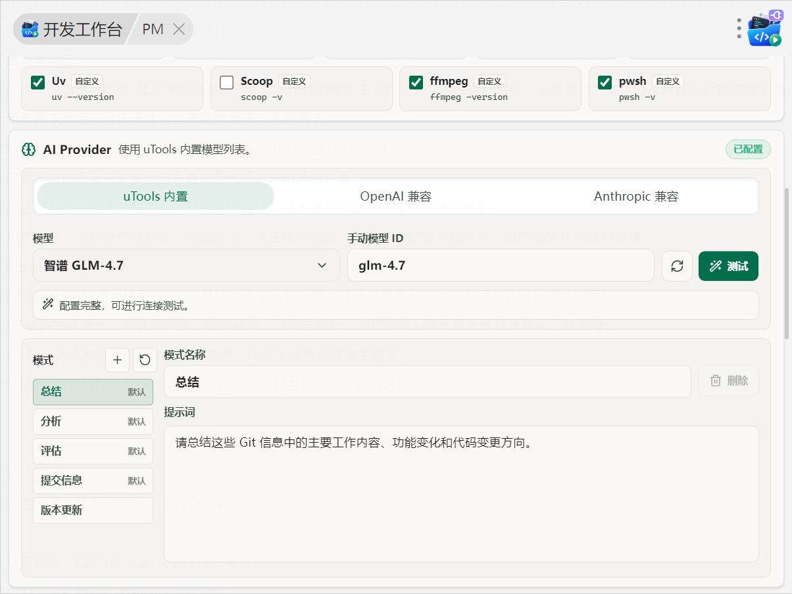

<p align="center">
  
</p>

<h1 align="center">开发工作台</h1>

<p align="center">uTools Project Launch · 把本地项目与常用开发任务收进一个入口</p>

本地开发工作台，支持项目启动与管理、脚本配置与日志查看、Git 操作、AI 分析（支持自定义模式）、自动任务、文件浏览、备忘待办和开发环境检测。

## 它能做什么

| 能力       | 说明                                                                    |
| ---------- | ----------------------------------------------------------------------- |
| 项目管理   | 搜索、分组、排序和快速打开本地项目，支持配置导入导出                    |
| 脚本与日志 | 配置或自动发现启动脚本，实时查看输出、发送输入和停止进程                |
| 自动任务   | 定时串行执行脚本，支持随机时间窗口、自动输入、超时和执行历史            |
| Git 工作区 | 查看 Diff 和提交图，完成暂存、提交、分支、标签、远端及 stash 等常用操作 |
| AI 分析    | 总结或评估 Git 变更、生成提交信息，并在已有结果上继续修订               |
| 文件与备忘 | 浏览、预览和轻量编辑项目文件，记录 Markdown 备忘与待办                  |
| 开发环境   | 检测 Node.js、Python、Go、Git、Docker 等工具，也可添加自定义检测项      |
| 外部工具   | 使用偏好的应用或终端打开项目，并提供 Agent 可调用工具，AI 自动完成配置  |

## 开始使用

1. 打开“开发工作台”，添加项目目录并选择项目类型。
2. 手动添加启动脚本，或从 `package.json`、`Makefile` 自动发现可用命令。
3. 从首页运行脚本、打开项目，或进入项目详情使用 Git、文件、备忘和自动任务等工具。

在 uTools 中可通过 `开发工作台`、`工作台`、`Dev Workbench` 或 `PM` 唤起插件。

## 界面预览



<details>
<summary>查看更多界面</summary>











</details>

## 可选功能

### 项目启动服务

默认情况下，脚本和自动任务由插件前台运行。需要在关闭插件或退出 uTools 后继续运行开发服务、构建脚本或定时任务，以及将运行日志持久化时，可以在设置页安装并启用 **Project Launch Service**。

- 服务默认关闭，不会自行下载、安装或启动。
- 启用后，新的脚本进程、自动任务和运行日志由本机服务统一管理；已有前台进程需先停止。
- 服务仅在本机运行，不需要管理员权限，也不会注册为开机自启的系统服务；设备重启后会停止。
- 安装、更新、验证和日志保留策略均可在设置页管理；自动下载失败时，可从 [GitHub Releases](https://github.com/Wwyxa/utools-project-launch/releases) 手动安装对应平台的文件。
- 禁用或移除服务前，应先停止它管理的活动进程和任务。

服务文件与持久化日志位于 `~/.utools-project-launch/service/`。服务启用但文件缺失或不兼容时，插件会阻止新的运行请求并提示修复，不会静默切回前台执行，以免产生重复任务。

### 文件图标包

设置页可按需安装 `vscode-icons` 衍生图标包，用于项目文件树和 Git 文件列表。图标包独立下载，默认不安装、不联网，也不进入主插件构建产物；安装时会校验下载来源、SHA-256、资源清单和许可证通知，随时可以切回内置图标。

## 数据与权限

- 项目配置、偏好、备忘和待办主要保存在本地 uTools / 浏览器存储中。
- 插件需要本地 Node.js 能力来访问项目目录、运行命令、读取文件、执行 Git 操作和检测开发工具。
- Git 写操作会直接作用于本地工作区，执行暂存、丢弃、提交或切换分支前请确认当前状态。
- AI 分析会将选中的 Git 信息或 Diff 发送给你配置的模型提供方，请按项目的数据策略选择接口。
- 可选项目启动服务使用本地回环连接，自动任务配置会在本机加密保存，不会把项目数据迁移到云端。

## 从源码运行

需要 Node.js 和 npm；只有开发可选项目启动服务时才需要 Go 1.23。

```bash
npm install
npm run dev
```

开发服务默认运行在 `http://localhost:3421`。

构建并加载到 uTools：

```bash
npm test
npm run lint
npm run build
```

构建产物位于 `dist/`。在 uTools 开发者工具中选择 `dist/plugin.json`，不要直接加载项目根目录。

常用命令：

| 命令                                   | 用途                       |
| -------------------------------------- | -------------------------- |
| `npm run dev`                          | 启动 Vite 开发服务         |
| `npm test`                             | 运行 Vitest 测试           |
| `npm run lint`                         | 执行 TypeScript 类型检查   |
| `npm run build`                        | 构建插件到 `dist/`         |
| `npm run go:test` / `npm run go:build` | 测试或构建可选项目启动服务 |

更多模块级校验和基准命令可在 `package.json` 的 `scripts` 中查看。

## 技术栈

Vue 3、TypeScript、Vite、Pinia、Tailwind CSS、Vitest，以及可选的 Go 项目启动服务。

## 版本历程

- **v1.9.0**：加入可独立安装的文件图标包和 uTools AI Agent 项目管理工具；优化 Git 批量操作、日志搜索、确认交互与下载进度。
- **v1.8.x**：增强 Git 文件树、stash 与标签操作，支持项目默认标签页；改善卡片排序、服务稳定性和 Windows 脚本输出兼容性。
- **v1.7.x**：发布可选项目启动服务，加入服务安装更新、持久化日志和运行恢复；扩展自动任务与 Git 远端操作。
- **v1.6.x**：完善自动任务、外部应用、AI 多轮修订、主题联动和开发环境检测。
- **v1.5.x**：形成项目管理、脚本日志、Git 工作区、备忘待办等基础能力。

## 贡献

欢迎提交 Issue 和 Pull Request。

- 请让每个 PR 保持聚焦，一个 PR 只解决一个问题，大改动请先开 Issue 讨论。
- 提交信息使用 Conventional Commits；修改逻辑时补充对应测试，并至少运行：

```bash
npm run lint
npm test
npm run build
```

涉及项目启动服务时，请同时运行 `npm run go:fmt`、`npm run go:vet` 和 `npm run go:test`。

## 社区
- 感谢 [LinuxDo](https://linux.do) 社区的支持